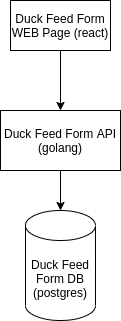
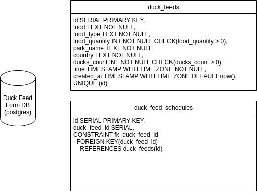

# Duck Feed WEB

## Running project

1. `npm install`
2. `npm start`

## Running tests

1. `npm install`
2. `npm test`

## Approach

I decided to create a single page website using React with Typescript and the default architecture for React.

## Technologies chosen

Application: React, react-hook-form, react-redux, typescript, material-ui, rollbar
Testing: testing-library, jest

## Component Diagram

## Database Diagram

## Hours Spent

About 10 Hours